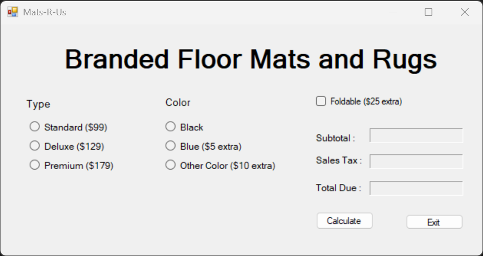
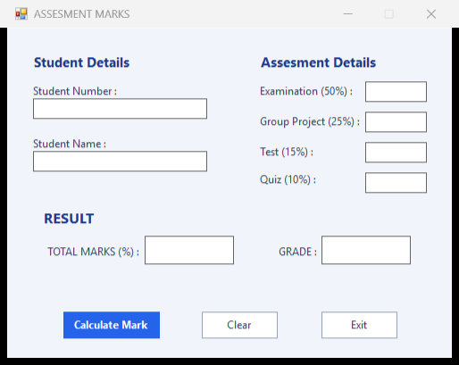

# VB.NET WinForms Labs

Two university VB.NET lab solutions (2022) preserved as-is, bundled in one repo. Each is a
single-form Windows Forms app on .NET Framework 4.7.2.

### floormat — "Mats R Us" price calculator (`floormat-calculator/`)



Pick a grade (Standard RM99 / Deluxe RM129 / Premium RM179), a colour (Black +0 / Blue +5 /
Other +10), optionally foldable (+25), and it shows subtotal, 6% sales tax, and total due.

### marks — assessment-mark grader (`assessment-marks/`)



Validates five inputs with `TryParse`, sums exam + group project + test + quiz marks, and
assigns a grade (A ≥ 85, B ≥ 75, C ≥ 65, D ≥ 55, else E).

> **New developer? Start with [`.docs/tldr.md`](.docs/tldr.md)** — every doc summarised on one
> page. The full guide lives in [`.docs/`](.docs/README.md).

## Prerequisites

| Tool | Version | Installed by |
| --- | --- | --- |
| PowerShell + winget | Windows 10/11 stock | — (the only true prerequisites) |
| MSBuild | Framework copy ships with Windows (VS Build Tools optional) | — (detected by `setup.ps1`, never auto-installed) |
| Git | any recent | `setup.ps1` |
| Node.js | LTS (for the Claude CLI) | `setup.ps1` |
| uv + Python | latest (for `.claude` tooling) | `setup.ps1` |
| just | any recent | `setup.ps1` |
| Claude Code CLI | latest | `setup.ps1` (optional, for AI-assisted dev) |

## Quick start

```powershell
# 1. One-time machine setup (idempotent — safe to re-run)
pwsh ./setup.ps1

# 2. Close and reopen PowerShell so PATH updates land
just build-all        # build both solutions
just run floormat     # open the floor-mat calculator window
just run marks        # open the assessment-mark grader window
```

`just run {lab}` builds and opens the lab's desktop window. Close the windows with `just stop`.

## Commands

Run `just` with no arguments to list every recipe. The ones you'll use daily:

| Command | What it does |
| --- | --- |
| `just build floormat` / `just build marks` | Build one lab's solution (Debug) |
| `just build-all` | Build both solutions; fails on the first error |
| `just run floormat` / `just run marks` | Build then launch the lab's window |
| `just stop` | Close only THIS repo's lab windows (path-scoped) |
| `just clean` | Delete `bin\` and `obj\` for both labs |
| `just test` | Run the launch/lifecycle smoke suite for BOTH labs (`tests/smoke.ps1`) |
| `just claudex` | Launch Claude Code (Sonnet, all permissions) |

## Testing

`just test` runs [`tests/smoke.ps1`](tests/smoke.ps1) — one parameterized build +
launch/lifecycle smoke suite covering **both** labs, exit 0 only on a full pass:

1. **Build gate** — `just build-all` must exit 0 and produce both exes
   (`LabAssgQ1.exe`, `LabAssg1Q2.exe`).
2. **Launch/lifecycle, per lab** (floormat then marks) — the exe is launched; within 10 s it
   must expose a main window handle with the expected title (**Mats-R-Us** /
   **ASSESMENT MARKS** — the archive's spelling); it must still be alive 3 s after launch
   (no startup crash); it is then closed via `CloseMainWindow()` (WM_CLOSE, with `Kill()` as
   fallback) and zero processes may be left running from that exe path.
3. **Warning-baseline gate** — a rebuild of both solutions capturing MSBuild output must
   introduce no warning *codes* beyond the documented three-warning baseline (the uncoded
   ToolsVersion 15.0→4.0 notice, MSB3644, MSB3270 — see Troubleshooting). A warning-free
   Build Tools 2022 build passes trivially.

**Why smoke tests, not unit tests.** This is deliberately a smoke suite. Both labs are GUI
coursework preserved as-submitted: all logic lives in the WinForms code-behind click handlers
of each `Form1.vb`, so meaningful unit tests would require extracting that logic into testable
classes — a rewrite of the submissions this repo exists to preserve. Rather than ship hollow
tests that pretend otherwise, the suite verifies what can be verified honestly without
touching lab source: both solutions build within their documented warning baseline, and each
exe launches, shows its window, survives startup, and shuts down cleanly.

## Troubleshooting

### Build prints `warning MSB3644: reference assemblies for .NETFramework,Version=v4.7.2 were not found`

Expected with the Framework MSBuild that ships with Windows — the 4.7.2 targeting pack isn't
installed, so references resolve from the GAC instead. The build still exits 0 and the exe
works. Installing "Visual Studio Build Tools 2022" manually (elevated) removes it; the
justfile automatically prefers that MSBuild when present.

### Build prints `Project file contains ToolsVersion="15.0"` and/or `warning MSB3270` (processor architecture mismatch)

Both are the other two expected warning classes with Framework MSBuild: the old-style
project falls back to ToolsVersion 4.0, and the AnyCPU project references 64-bit GAC
assemblies. Benign — exit code stays 0. Details in
[`.docs/06-troubleshooting/common-issues.md`](.docs/06-troubleshooting/common-issues.md).

### `just build xyz` fails with `Unknown lab 'xyz'`

The `lab` parameter accepts exactly `floormat` or `marks` — the recipe maps them to the two
`.sln` files.

### A lab window shows stale behavior after a source edit

The window you're testing predates the rebuild. Run `just stop`, then `just run {lab}` (the
`run` recipe always rebuilds first). If it persists, `just clean` then rebuild.

More in [`.docs/06-troubleshooting/common-issues.md`](.docs/06-troubleshooting/common-issues.md).

## Project layout

```
vbnet-winforms-labs/
  floormat-calculator/
    FloorMat Program.sln       # solution — note the space in the filename
    LabAssgQ1/                 # "Mats R Us" price calculator (frmMatsRUs)
  assessment-marks/
    Assesment Mark Program.sln # solution — archive's "Assesment" spelling kept
    LabAssg1Q2/                # student grade calculator
  docs/images/                 # README screenshots (floormat.png, marks.png)
  tests/smoke.ps1              # launch/lifecycle smoke suite for both labs (`just test`)
  .docs/                       # full documentation set (start at tldr.md)
  .claude/                     # Claude Code skills, hooks, settings
  justfile                     # build/run/stop recipes
  setup.ps1                    # one-time machine bootstrap
```
